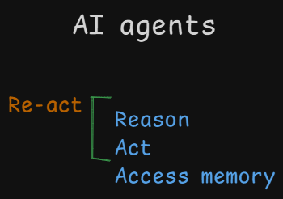

# AI Assistants vs. AI Agents

## Assistants

An AI assistant is software designed to help improve the efficiency or performance of tasks. They use natural language processing (NLP) and machine learning to understand and respond to human language, both written and spoken. AI assistants can range from simple chatbots to complex AI powered personal assistants capable of performing sophisticated tasks.

## What are AI Agents?

AI agents are a type of artificial intelligence that can reason, act, and access memory. They are different from traditional AI models in that they can be more autonomous and can handle more complex tasks.

**Key points:**

* **Monolithic models vs. compound AI systems:** Monolithic models are limited by the data they have been trained on, while compound AI systems can be more flexible and adaptable.
* **System design:** Compound AI systems are designed to be more modular and can be composed of different components, such as models, programs, and databases.
* **Agentic approach:** AI agents use a large language model to control the logic of the system and can reason about how to solve problems.
* **Capabilities of AI agents:** AI agents can reason, act, and access memory. **Re-act**
* **Types of AI agents:** There are different types of AI agents, such as react agents and RAG systems.
* **Future of AI agents:** AI agents are still in their early days, but they have the potential to be very powerful and versatile.

### React agents

are configured using a framework called React, which combines the reasoning and acting components of AI agents. React agents are given a prompt or instruction and then use their reasoning capabilities to come up with a plan to solve the problem. They can then call external tools to execute their plan. React agents are more flexible than RAG systems and can be used for a wider range of tasks.

### RAG systems

are retrieval-augmented generation systems. They use a large language model to generate text, but they also have access to a knowledge base of information. RAG systems can use this knowledge base to retrieve relevant information and then use it to generate a more accurate and informative response. RAG systems are often used for tasks such as question answering and summarization.

Here is a table that summarizes the key differences between React and RAG system agents:

| Feature | React agent | RAG system |
|---|---|---|
| Architecture | Combines reasoning and acting components | Uses a large language model and a knowledge base |
| Capabilities | Can be used for a wider range of tasks | Often used for question answering and summarization |
| Flexibility | More flexible | Less flexible |
