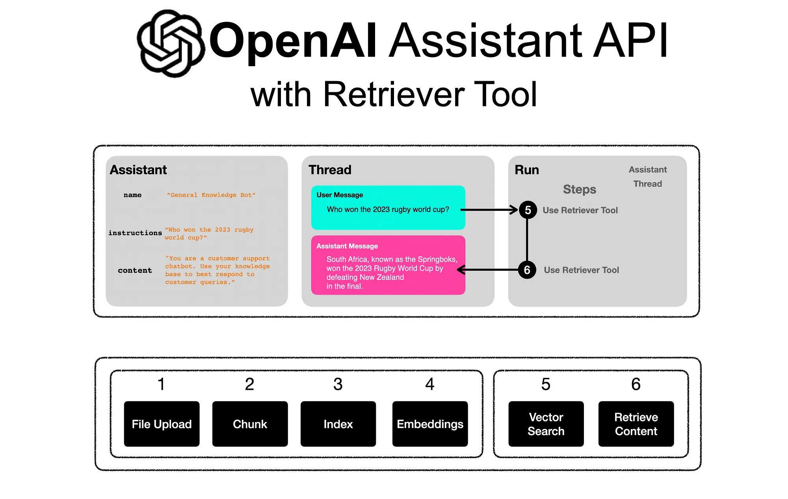
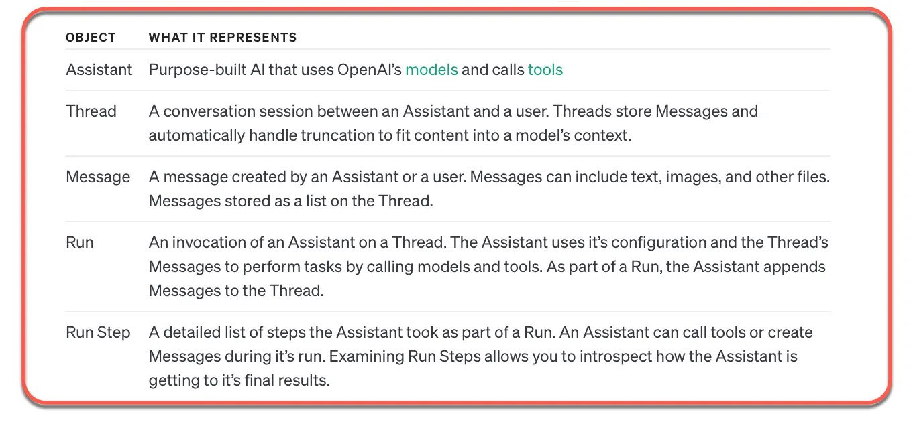

# Assistants Knowledge Retrieval

Retrieval augments the Assistant with knowledge from outside its model, such as proprietary product information or documents provided by your users. Once a file is uploaded and passed to the Assistant, OpenAI will automatically chunk your documents, index and store the embeddings, and implement vector search to retrieve relevant content to answer user queries.

## How it works

The model then decides when to retrieve content based on the user Messages. The Assistants API automatically chooses between two retrieval techniques:

1. it either passes the file content in the prompt for short documents, or
2. performs a vector search for longer documents

Retrieval currently optimizes for quality by adding all relevant content to the context of model calls. We plan to introduce other retrieval strategies to enable developers to choose a different tradeoff between retrieval quality and model usage cost.

Official Docs <https://platform.openai.com/docs/assistants/tools/knowledge-retrieval>
