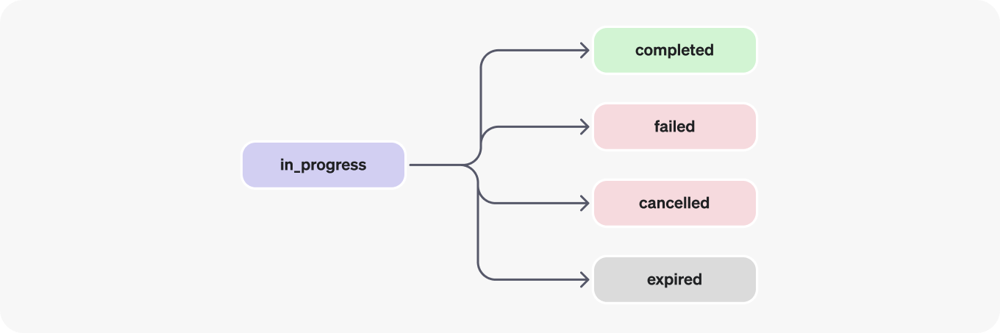

# Assistants API function calling

Similar to the [Chat Completions API](/3-ChatGPT/1-chat-completion/), the Assistants API supports function calling. Function calling allows you to describe functions to the Assistants and have it intelligently return the functions that need to be called along with their arguments. The Assistants API will pause execution during a Run when it invokes functions, and you can supply the results of the function call back to continue the Run execution.

An assistant is a purpose-built AI that has specific instructions, leverages extra knowledge, and can call models and tools to perform tasks.

## Run Life Cycle

### STATUS DEFINITION

<https://platform.openai.com/docs/assistants/how-it-works/runs-and-run-steps>

**queued:**

When Runs are first created or when you complete the required_action, they are moved to a queued status. They should almost immediately move to in_progress.

**in_progress:**

While in_progress, the Assistant uses the model and tools to perform steps. You can view progress being made by the Run by examining the Run Steps.

**completed:**

The Run successfully completed! You can now view all Messages the Assistant added to the Thread, and all the steps the Run took. You can also continue the conversation by adding more user Messages to the Thread and creating another Run.

**requires_action:**

When using the Function calling tool, the Run will move to a `required_action` state once the model determines the names and arguments of the functions to be called. You must then run those functions and submit the outputs before the run proceeds. If the outputs are not provided before the `expires_at` timestamp passes (roughly 10 mins past creation), the run will move to an expired status.

**expired:**

This happens when the function calling outputs were not submitted before `expires_at` and the run expires. Additionally, if the runs take too long to execute and go beyond the time stated in `expires_at`, our systems will expire the run.

**cancelling:**

You can attempt to cancel an `in_progress` run using the Cancel Run endpoint. Once the attempt to cancel succeeds, status of the Run moves to cancelled. Cancellation is attempted but not guaranteed.
cancelled Run was successfully cancelled.

**failed:**

You can view the reason for the failure by looking at the `last_error` object in the Run. The timestamp for the failure will be recorded under `failed_at`.

### Polling for updates

In order to keep the status of your run up to date, you will have to periodically retrieve the Run object. You can check the status of the run each time you retrieve the object to determine what your application should do next. We plan to add support for streaming to make this simpler in the near future.

### Thread locks

When a Run is `in_progress` and not in a terminal state, the Thread is locked. This means that:

New Messages cannot be added to the Thread.

New Runs cannot be created on the Thread.

## Run steps

Most of the interesting detail in the Run Step object lives in the `step_details` field. There can be two types of step details:

1. `message_creation`: This Run Step is created when the Assistant creates a Message on the Thread.
2. `tool_calls`: This Run Step is created when the Assistant calls a tool. Details around this are covered in the relevant sections of the Tools guide.

Official Docs <https://platform.openai.com/docs/assistants/tools/function-calling>

Code examples <https://cookbook.openai.com/examples/assistants_api_overview_python>

Supported files <https://platform.openai.com/docs/assistants/tools/supported-files>
