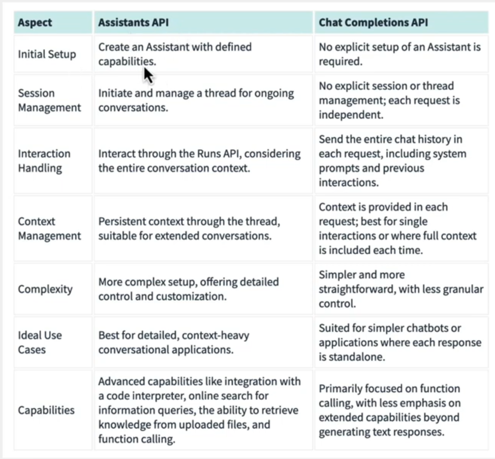

# Assistants API

A stateful API that keeps the context of previous chat. It has threads, which represent the state of conversation. It allows developers to craft powerful **AI assistants** that can perform variety of tasks.

- Assistants API extends the existing OpenAI API
  - Easier to build AI assistants
  - Bots, AI tools, etc..

## Without Assistants API

> Building Complex AI applications is very difficult.

Developers need to:

- Manage infrastructures
- Data
- Models
- Prompts
- Application state
- Embeddings
- Storage mechanism
- and more...

Developers need to spend most of their time stitching tech together, instead of solving actual problems.

## Assistants API Benefits

- Persistent threading for ongoing conversations
  - Being able to save messages & context of the conversation

**Knowledge Retrieval:**

- Retrieval mechanisms for digging through data
  - upload files for the models to use for additional knowledge-base
- Code Interpreter
  - Write, analyze code...

**Assistants function calling:**

- Function calling to execute custom tasks with ease

*According to the official docs:*

The Assistants API allows you to build AI assistants within your own applications. An Assistant has instructions and can leverage models, tools, and knowledge to respond to user queries. The Assistants API currently supports three types of tools:

- Code Interpreter
- Retrieval
- Function calling.

In the future, we plan to release more OpenAI-built tools, and allow you to provide your own tools on our platform.

You can explore the capabilities of the Assistants API using the Assistants playground or by building a step-by-step integration outlined in this guide. At a high level, a typical integration of the Assistants API has the following flow:

## Assistants API integration steps

1. Create an Assistant in the API by defining its custom instructions and picking a model. If helpful, enable tools like Code Interpreter, Retrieval, and Function calling.
2. Create a Thread when a user starts a conversation.
3. Add Messages to the Thread as the user ask questions.
4. Run the Assistant on the Thread to trigger responses. This automatically calls the relevant tools.

## Assistants vs Chat Completions API

Official Documentation <https://platform.openai.com/docs/assistants/overview>
