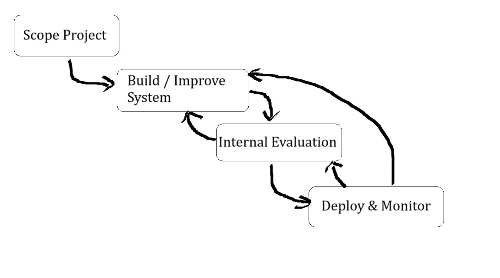

# Generative AI for Everyone

## How LLMS Work?

LLMS are built using supervised learning **(A -> B)** to repeatedly
predict the next word.

## Tools to improve Performance

Building Generative AI apps is highly empirical (experimental)
process. We repeatedly find & fix mistakes.

### Prompting

### RAG (Retrieval Augmented Generation)

> Give LLM access to external data source.

### Fine Tune Models

> Adapt LLM to Your Task

### Pretrain Models

> Train LLM from scratch.

## LifeCycle of Generative AI Project

