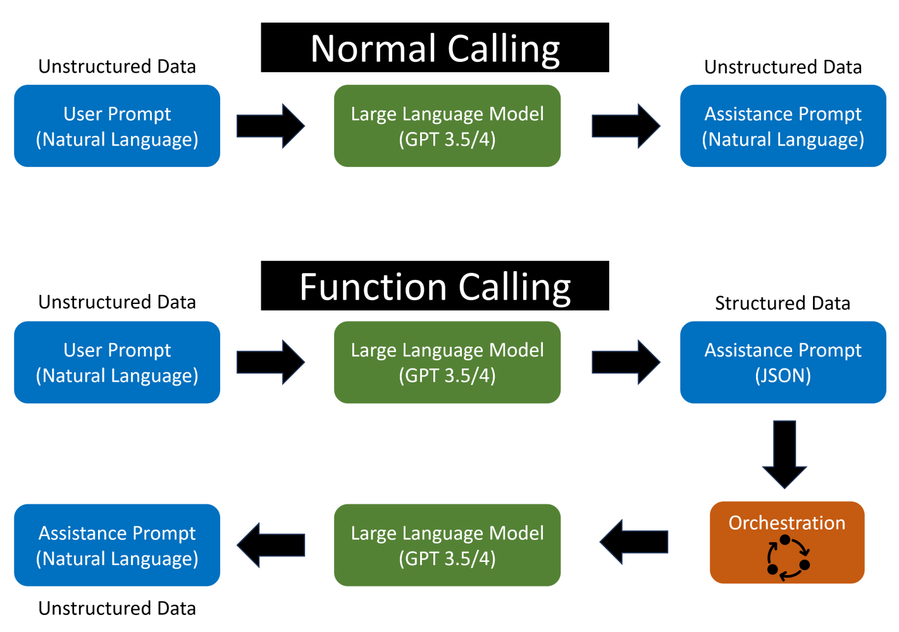
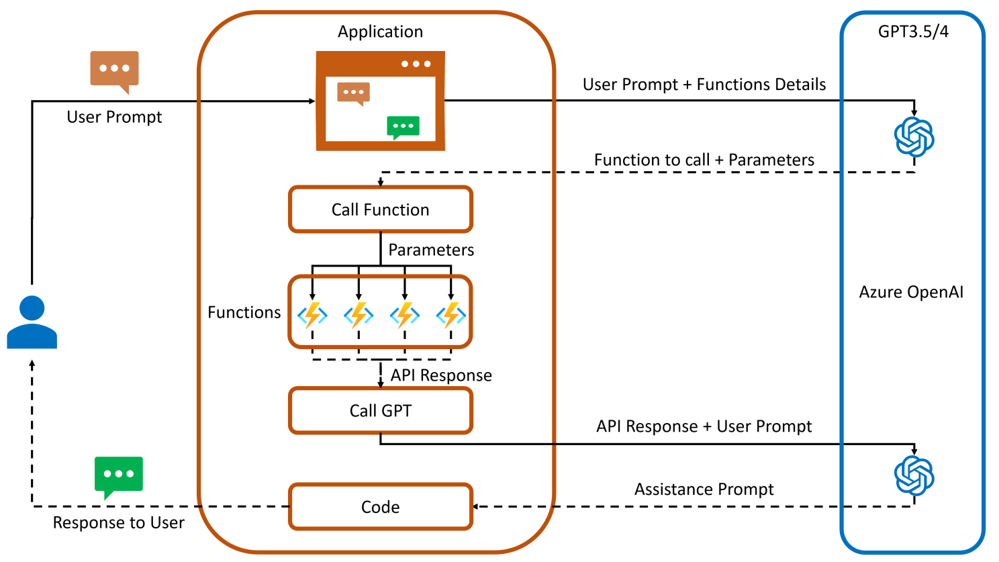

# Function Calling

In an API call, you can describe functions and have the model intelligently choose to output a JSON object containing arguments to call one or many functions. The Chat Completions API does not call the function; instead, the model generates JSON that you can use to call the function in your code.

The latest models (`gpt-3.5-turbo-0125` and `gpt-4-turbo-preview`) have been trained to both detect when a function should to be called (depending on the input) and to respond with JSON that adheres to the function signature more closely than previous models. With this capability also comes potential risks. We strongly recommend building in user confirmation flows before taking actions that impact the world on behalf of users (sending an email, posting something online, making a purchase, etc).

## Common Use Cases

Function calling allows you to more reliably get structured data back from the model. For example, you can:

- Create assistants that answer questions by calling external APIs (e.g. like ChatGPT Plugins) e.g. define functions like `send_email(to: string, body: string)`, or `get_current_weather(location: string, unit: 'celsius' | 'fahrenheit')`
- Convert natural language into API calls e.g. convert "Who are my top customers?" to `get_customers(min_revenue: int, created_before: string, limit: int)` and call your internal API
- Extract structured data from text e.g. define a function called `extract_data(name: string, birthday: string), or sql_query(query: string)`
...and much more!

### Sequence of Steps for function calling

1. Call the model with the user query and a set of functions defined in the functions parameter.
2. The model can choose to call one or more functions; if so, the content will be a stringified JSON object adhering to your custom schema (note: the model may hallucinate parameters).
3. Parse the string into JSON in your code, and call your function with the provided arguments if they exist.
4. Call the model again by appending the function response as a new message, and let the model summarize the results back to the user.

## The basic sequence of steps for function calling is as follows

1. Call the model with the user query and a set of functions defined in the functions parameter.
2. The model can choose to call one or more functions; if so, the content will be a stringified JSON object adhering to your custom schema (note: the model may hallucinate parameters).
3. Parse the string into JSON in your code, and call your function with the provided arguments if they exist.
4. Call the model again by appending the function response as a new message, and let the model summarize the results back to the user.

<https://www.linkedin.com/pulse/azure-openai-function-calling-tarun-sharma/>

## Parallel Function Calling

Parallel function calling is the model's ability to perform multiple function calls together, allowing the effects and results of these function calls to be resolved in parallel. This is especially useful if functions take a long time, and reduces round trips with the API. For example, the model may call functions to get the weather in 3 different locations at the same time, which will result in a message with 3 function calls in the tool_calls array, each with an id. To respond to these function calls, add 3 new messages to the conversation, each containing the result of one function call, with a tool_call_id referencing the id from `tool_calls`.

Official OpenAi function calling documentation. <https://platform.openai.com/docs/guides/function-calling>

How to call functions with chat models <https://cookbook.openai.com/examples/how_to_call_functions_with_chat_models>
