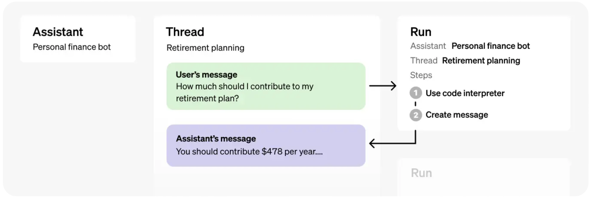
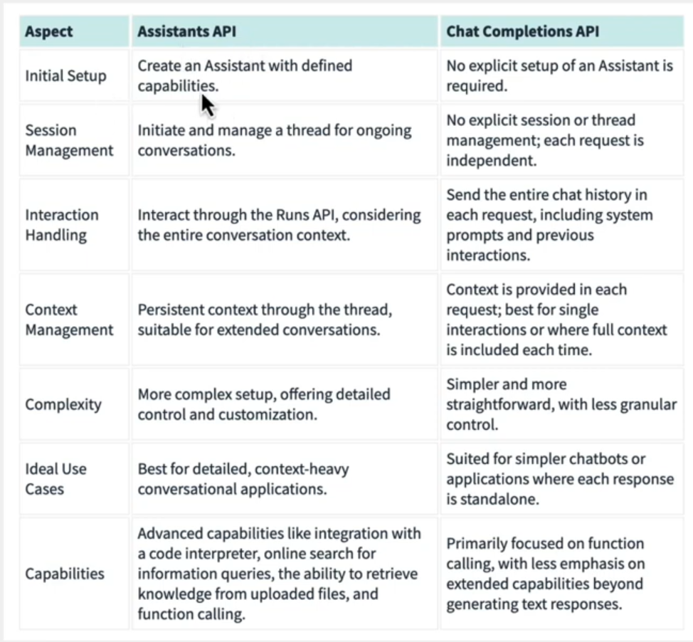

# Assistants API

A stateful API that keeps the context of previous chat. It has threads, which represent the state of conversation. It allows developers to craft powerful **AI assistants** that can perform variety of tasks.

- Assistants API extends the existing OpenAI API
  - Easier to build AI assistants
  - Bots, AI tools, etc..

## Without Assistants API

> Building Complex AI applications is very difficult.

Developers need to:

- Manage infrastructures
- Data
- Models
- Prompts
- Application state
- Embeddings
- Storage mechanism
- and more...

Developers need to spend most of their time stitching tech together, instead of solving actual problems.

## Assistants API Benefits

- Persistent threading for ongoing conversations
  - Being able to save messages & context of the conversation
- Retrieval mechanisms for digging through data
  - upload files for the models to use for additional knowledge-base
- Code Interpreter
  - Write, analyze code...
- Function calling to execute custom tasks with ease

## Assistants vs Chat Completions API

